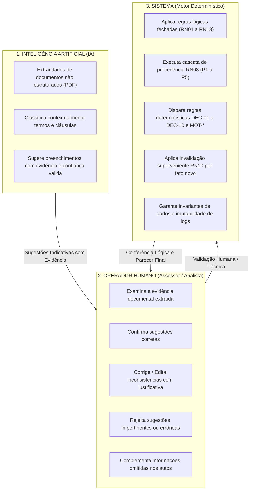
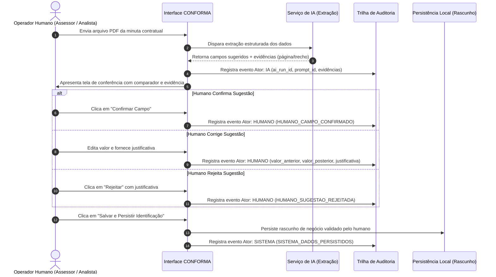

# CONFORMA GSASP — Roadmap de Ingestão Inteligente e Trilha de Auditoria (Humano × IA × Sistema)

Documento diretor para a nova fase de desenvolvimento do CONFORMA GSASP.
**Fase:** Sprint 5 — Ingestão Inteligente + Trilha de Auditoria Humano × IA × Sistema.
**Data de emissão:** 01/10/2026.
**Baseline técnico de partida:**
- **Tag de congelamento do MVP:** `v0.1.0-mvp-demo` (apresentado e validado formalmente com nota 10).
- **Branch ativa:** `s5-ingestao-auditoria`.
- **Commit-base:** `74225d1`.
- **Suíte de testes automatizados:** 157 testes unitários aprovados, 0 falhas, 20 suítes.
- **Build de produção:** 100% íntegro (Vite + TypeScript + PWA com Service Worker precache).

---

## 1. Contexto e Objetivo Geral da Nova Fase

Após a homologação e apresentação do MVP demonstrativo com excelência, o projeto CONFORMA GSASP avança para a automação assistida da instrução processual com governança rigorosa.

O objetivo da **Sprint 5** é introduzir a **ingestão inteligente de documentos** (minutas contratuais, termos aditivos e pareceres em PDF) acoplada a uma **trilha de auditoria tripartite**, estabelecendo um padrão de conformidade e transparência para a instrução processual.

> [!IMPORTANT]
> **Primeira Entrega Estrita da Sprint 5:**
> **Upload de uma minuta/PDF &rarr; extração da Identificação &rarr; evidência por campo &rarr; Confirmar / Editar / Rejeitar &rarr; persistência após validação humana.**
> Nenhuma informação extraída por modelos de inteligência artificial terá permissão para persistir diretamente no estado de negócio da aplicação sem antes passar pela validação expressa e individual do operador humano.

---

## 2. Princípio Fundamental de Separação de Papéis (A Regra de Ouro)

A governança do CONFORMA GSASP veda categoricamente a opacidade na atribuição de responsabilidades operacionais, analíticas e decisórias. Estabelece-se como princípio obrigatório e inegociável a seguinte segregação funcional:



### Síntese das Atribuições Mandatórias:
1. **A IA extrai, classifica e sugere:** Tem papel instrumental de apoio e processamento de linguagem natural. Não delibera, não valida, não conclui e não decide.
2. **O Humano confirma, corrige, rejeita e complementa:** O operador realiza a validação humana/técnica, observadas as competências do usuário e da autoridade competente. Sua atuação é ativa e responsável.
3. **O Sistema aplica regras determinísticas (RN / DEC / MOT):** O motor algorítmico do software executa regras normativas e lógicas estritas, livres de estocasticidade ou inferência estatística.
4. **Vedação de Confusão:** Nenhum desses atores deve ser confundido na trilha de auditoria, na interface ou nos relatórios executivos.

---

## 3. Trilha de Auditoria Tripartite: Definição dos Atores

A trilha de auditoria deve categorizar inequivocamente cada evento com base no agente que o originou, utilizando três atores padronizados:

| Ator | Definição | Exemplos de Eventos Próprios | O que NUNCA pode ser atribuído a este ator |
|---|---|---|---|
| `IA` | Agente computacional probabilístico / generativo / OCR. | `IA_EXTRACAO_EXECUTADA`, `IA_CAMPO_SUGERIDO`, `IA_AMBIGUIDADE_DETECTADA`. | Validação de campo, aprovação de conformidade, deliberação formal, aplicação de regras RN08/RN10. |
| `HUMANO` | Servidor público, assessor técnico, revisor ou autoridade identificada. | `HUMANO_CAMPO_CONFIRMADO`, `HUMANO_SUGESTAO_EDITADA`, `HUMANO_SUGESTAO_REJEITADA`, `HUMANO_DIVERGENCIA_JUSTIFICADA`, `HUMANO_PARECER_HOMOLOGADO`. | Geração autônoma de sugestões por OCR, cálculos internos do motor determinístico. |
| `SISTEMA` | Código determinístico da aplicação, validadores de regras de negócio e barramento de persistência. | `SISTEMA_VALIDACAO_ESTRUTURAL`, `SISTEMA_REGRA_APLICADA` (DEC/MOT), `SISTEMA_INVALIDACAO_SUPERVENIENTE_RN10`, `SISTEMA_INTEGRIDADE_VERIFICADA`. | Julgamentos discricionários ou de mérito administrativo, extrações heurísticas de PDFs. |

---

## 4. Metadados Mínimos Mandatórios de Toda Execução de IA

Para atender aos preceitos de explicabilidade, reprodutibilidade e conformidade, **toda e qualquer execução futura de IA deverá registrar e preservar, no mínimo, os 11 atributos abaixo**:

```typescript
export interface MetadadosExecucaoIA {
  /** 1. Identificador estável do prompt no catálogo de engenharia */
  prompt_id: string;

  /** 2. Versão semântica ou identificador do template do prompt */
  prompt_version: string;

  /** 3. UUID único da rodada/execução para correlação de eventos */
  ai_run_id: string;

  /** 4. Evento originador: upload_manual | reprocessamento_usuario | execucao_assistida */
  gatilho_automacao: 'UPLOAD_MANUAL' | 'REPROCESSAMENTO_USUARIO' | 'EXECUCAO_ASSISTIDA';

  /** 5. Provedor e identificador do modelo utilizado */
  modelo_provedor: string;

  /** 6. Nome, extensão, tamanho e identificador de integridade/hash do arquivo fonte submetido (SHA-256 como diretriz técnica candidata) */
  documentos_fontes: Array<{
    nome_arquivo: string;
    mime_type: string;
    tamanho_bytes: number;
    hash_integridade?: string;
  }>;

  /** 7. Coordenadas da evidência que fundamentou cada extração (página e trecho literal) */
  evidencias_localizacao: Array<{
    campo: string;
    pagina: number;
    trecho_citado: string;
    posicao_bbox?: [number, number, number, number];
  }>;

  /** 8. Saída bruta ou referência segura à saída, conforme política de retenção e segurança */
  saida_produzida_ou_referencia: string;

  /** 9. Dicionário dos campos estruturados sugeridos (grau de confiança registrado somente quando o modelo ou pipeline fornecer métrica tecnicamente válida; não criar ou inferir percentual artificial) */
  campos_sugeridos: Record<string, {
    valor: unknown;
    grau_confianca?: number; // registrado exclusivamente quando provido tecnicamente pelo modelo/pipeline
  }>;

  /** 10. Carimbo de tempo padronizado (ISO 8601 UTC como diretriz técnica candidata) */
  timestamp: string;

  /** 11. Referência cruzada aos eventos humanos subsequentes que avaliaram a rodada */
  intervencoes_humanas_posteriores: string[]; // IDs dos eventos do tipo HUMANO_*
}
```

---

## 5. Rastreabilidade da Alteração Humana sobre Sugestões da IA

Sempre que um operador humano divergir, corrigir ou rejeitar um dado sugerido pela inteligência artificial, o sistema deve registrar um evento específico do ator `HUMANO`, contendo:

1. **`valor_anterior`:** O valor originalmente sugerido pela IA (ou estado preexistente).
2. **`valor_posterior`:** O valor retificado e acolhido pelo operador.
3. **`usuario`:** Identificador e perfil simulado/autenticado do operador (`id`, `nome`, `papel`).
4. **`data_hora`:** Timestamp da manifestação.
5. **`justificativa`:** Motivação textual do operador (obrigatória em divergências materiais ou rejeições, nos termos da RN02 e RN13).



---

## 6. Segregação e Atribuição de Regras Determinísticas ao SISTEMA

As regras lógicas implementadas nas Sprints 3 e 4 constituem o núcleo normativo determinístico do CONFORMA GSASP. Elas **nunca** podem ser registradas na auditoria como atos de IA, sob pena de falseamento da natureza dos algoritmos:

- **Regra RN10 (Invalidação Dinâmica por Fato Superveniente):** Ao alterar uma data, valor ou resposta em etapa anterior, a conclusão homologada é invalidada pelo **`SISTEMA`** (evento `SISTEMA_INVALIDACAO_SUPERVENIENTE_RN10`).
- **Regra RN08 (Cascata de Precedência P1 a P5):** O enquadramento em P1 (saneamento por falta de dados), P2 (óbice impeditivo), P3 (saneamento documental), P4 (ressalva não impeditiva) ou P5 (plena regularidade) é derivado determinística e logicamente pelo **`SISTEMA`**.
- **Tabela de Decisão DEC-01 a DEC-10 e Motivos MOT-*:** As tabelas de conferência lógica operam por inferência determinística (verdadeiro/falso). Cada disparo é emitido como ação estrita do **`SISTEMA`**.

> [!CAUTION]
> É expressamente proibido rotular relatórios ou telas com menções do tipo "A Inteligência Artificial concluiu que o processo não deve ser assinado". O sistema aplica a regra DEC; a IA apenas apoia a leitura inicial; quem realiza a validação técnica é o assessor, cabendo a decisão à autoridade competente.

---

## 7. Requisitos Arquiteturais para Uso Institucional Futuro

Embora o protótipo utilize armazenamento local do navegador para viabilizar demonstrações e desenvolvimento ágil, o desenho da arquitetura de dados da auditoria deve considerar os seguintes princípios institucionais corporativos como diretrizes:

1. **Trilha Append-Only (Apenas Inclusão):** Objetivo de manter a base de auditoria estritamente aditiva (sem operações de exclusão ou sobrescrita de eventos).
2. **Eventos Imutáveis:** Uma vez gravado, o registro do evento não pode ser alterado ou apagado.
3. **Retificação por Novo Evento:** Qualquer correção, reconsideração ou desfazimento gera um novo evento vinculado ao ID do evento antecedente, preservando a cadeia histórica íntegra.
4. **Autenticação e Rastreabilidade:** Identificação inequívoca de agentes (humanos e serviços de sistema/IA).
5. **Integridade (Diretriz Técnica Candidata):** Mecanismos de integridade (como encadeamento de hashes criptográficos, sendo SHA-256 uma diretriz técnica candidata) para detecção de adulterações.
6. **Controle de Acesso e Permissões (Diretriz Técnica Candidata):** Proteção dos registros contra visualização ou extração indevida (sendo RBAC uma diretriz técnica candidata, não uma arquitetura definitivamente escolhida nesta fase).
7. **Retenção e Descarte Seguro:** Observância às normas e políticas de retenção documental e segurança da informação.
8. **Exportação Padronizada para Auditoria (Diretriz Técnica Candidata):** Disponibilização de dados estruturados para auditoria, controle interno/externo e demais necessidades institucionais, conforme governança futura (com formatos como JSON e relatórios PDF/A tratados como diretrizes técnicas candidatas).

> [!NOTE]
> **Status da Persistência Atual:**
> A versão atual da aplicação baseada em **IndexedDB / localStorage permanece de natureza puramente demonstrativa e didática**. Ela simula fielmente a estrutura de eventos, mas não oferece garantias criptográficas ou inviolabilidade forense real contra manipulação direta nas ferramentas de desenvolvedor do navegador. Esse aviso de governança deve ser mantido de forma ostensiva na interface.

---

## 8. Planejamento das Entregas da Sprint 5

A Sprint 5 será desenvolvida em marcos modulares progressivos:

### Marco 5.1 — Pipeline de Ingestão de Minutas e Extração da Identificação (Primeira Entrega)
- Componente de upload seguro de documentos PDF (minutas e termos contratuais).
- Pipeline de leitura e extração estruturada dos 4 elementos essenciais (RN01) e metadados contratuais (Número, Instrumento, Objeto, Tipo, Contratado, CNPJ, Valor, Vigência).
- Visualizador com highlight / anotação de evidência: indicação da página e do trecho literal do documento de onde cada dado foi extraído.
- Painel de intervenção humana campo a campo com três botões de ação:
  - `[Confirmar]`: Acolhe a sugestão da IA.
  - `[Editar]`: Abre caixa de edição rápida com justificativa quando aplicável.
  - `[Rejeitar]`: Descarta a sugestão e mantém o campo limpo/em branco para preenchimento manual.
- Persistência no rascunho de negócio somente após a validação humana/técnica, observadas as competências do usuário e da autoridade competente.

### Marco 5.2 — Trilha de Auditoria Tripartite e Preservação de Metadados de IA
- Expansão do modelo `src/domain/tipos.ts` e do serviço `src/services/auditoria.ts` para incorporar a diferenciação estrita de atores (`HUMANO`, `IA`, `SISTEMA`).
- Armazenamento estruturado dos 11 atributos de telemetria de IA (`prompt_id`, `prompt_version`, `ai_run_id`, etc.), utilizando saída bruta ou referência segura à saída, conforme política de retenção e segurança.
- Registro de métrica de confiança exclusivamente quando o modelo/pipeline fornecer métrica tecnicamente válida, vedada a inferência de percentual artificial.
- Modal e visualizador de auditoria aprimorado, permitindo filtrar eventos por ator, tipo e campo modificado.

### Marco 5.3 — Diffs Auditáveis e Rastreabilidade de Divergências
- Registro e renderização dos pares de estado (`valor_anterior` vs. `valor_posterior`) com visualização de diff semântico.
- Exigência de preenchimento de justificativa antes de salvar alterações em divergências materiais ou rejeições da IA.
- Garantia de que a auditoria local não sofra duplicação ao recarregar a tela (F5) ou alternar de rotas.

### Marco 5.4 — Segregação e Blindagem das Regras do SISTEMA
- Auditoria autônoma dos disparos das regras determinísticas (RN10, RN08, DEC, MOT) com selo explícito de evento do `SISTEMA`.
- Verificação automatizada garantindo que nenhum evento de regra lógica receba atribuição de IA.

### Marco 5.5 — Homologação da Suíte de Testes e Documentação
- Cobertura integral de testes unitários para a ingestão e a nova auditoria.
- Garantia de não regressão dos 157 testes unitários existentes.
- Atualização do roteiro de demonstração para apresentação da funcionalidade de IA assistida.
